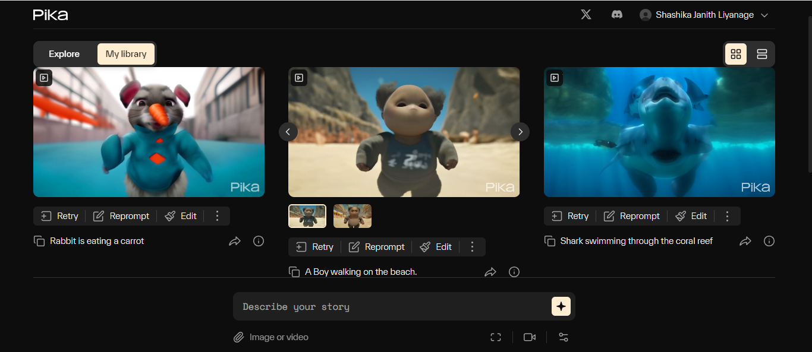

# Project Cinematic 01_05_2024 Demo

## Demo Scope

* Created videos from Pika text to video generating app.

## Demo Loom

https://www.loom.com/share/17018736862f4c0ea133efa4ec18a5cf?sid=a32d75a1-a632-4f41-afa8-7bd63b3b7c37

* Pika app is used to create videos with previously tested text prompts.

* Pika web app - https://pika.art/login

* This app could make videos in 3 seconds length.

* You can check generated videos in the files folder.

* Let's view the text prompt and its corresponding video below.

### 1. Rabbit is eating a carrot.

https://github.com/williamboomer87/cinematic/assets/113249314/dc09deef-1da0-41f8-90a6-15a90ff46a96

### 2. A Teddy bear running in London city.

https://github.com/williamboomer87/cinematic/assets/113249314/b3b7b8da-7858-4e57-b15c-43df3f6a432b

### 3. A Lion roaring on a rock.

https://github.com/williamboomer87/cinematic/assets/113249314/8d9d93cc-12f1-4a10-b5fc-00832903ea9c

### 4. Robot dancing in New York city.

https://github.com/williamboomer87/cinematic/assets/113249314/0cc8036f-9397-4b09-81e9-d857eb74c2d1

### 5. Shark swimming through the coral reef.

https://github.com/williamboomer87/cinematic/assets/113249314/beeecf46-ad0b-4f6e-b724-7d4cad672af4

### 6. A Boy walking on the beach.

https://github.com/williamboomer87/cinematic/assets/113249314/b18195fb-dfb0-4d1f-96d1-69ad037bb99f
