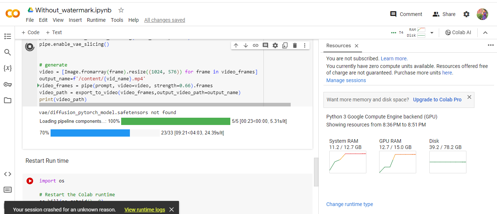

# Project Cinematic 01_10_2024 Demo

## Demo Scope

* Upscale generated videos without watermark.

## Demo Loom

https://www.loom.com/share/4b4d91a19df645448d3c1b4f8abb0c5d?sid=6eb31498-92cf-4683-9b2e-e91a4af6495e

* zeroscope_v2_567w is specifically designed for upscaling with zeroscope_v2_XL using vid2vid in the 1111 text2video extension by kabachuha. 

* Leveraging this model as a preliminary step allows for superior overall compositions at higher resolutions in zeroscope_v2_XL, permitting faster exploration in 576x320 before transitioning to a high-resolution render.

* For upscaling, it's recommended to use zeroscope_v2_XL via vid2vid in the 1111 extension.

* It works best at 1024x576 with a denoise strength between 0.66 and 0.85. Remember to use the same prompt that was used to generate the original clip.

* 11.2 GB System RAM and 12.7 GB GPU RAM is used for the whole process in the Google Colab.

* See some text prompts and example outputs that have been upscaled to 1024x576 using zeroscope_v2_XL below.

* "0.66" strength is used in the Upscaling code snippet for the "Robot dancing in New York city" text prompt.

'video_frames = pipe(prompt, video=video, strength=0.66).frames'

### 1. Robot dancing in New York city.

#### Before the upscaling

https://github.com/williamboomer87/cinematic/assets/113249314/2bb2966e-aaef-48f8-9f1a-08c4f32a0f7f

#### After the upscaling

https://github.com/williamboomer87/cinematic/assets/113249314/fb295acf-c3ba-4eb9-b8ce-d162e2b54c83

* " 0.85" strength is used in the Upscaling code snippet for  text prompts below.

'video_frames = pipe(prompt, video=video, strength=0.85).frames'

### 2. A Boy walking on the beach.

#### Before the upscaling

https://github.com/williamboomer87/cinematic/assets/113249314/a74f9079-f386-4d93-a1a7-69aad984ead9

#### After the upscaling

https://github.com/williamboomer87/cinematic/assets/113249314/454ce2c1-c133-40a6-b1e7-27ce173a39da

### 3. Rabbit is eating a carrot.

#### Before the upscaling

https://github.com/williamboomer87/cinematic/assets/113249314/6aaf065f-e530-47e0-adda-8353a831baf5

#### After the upscaling

https://github.com/williamboomer87/cinematic/assets/113249314/46eb2e9d-ec79-4cc7-88c9-154cd59bcd90
