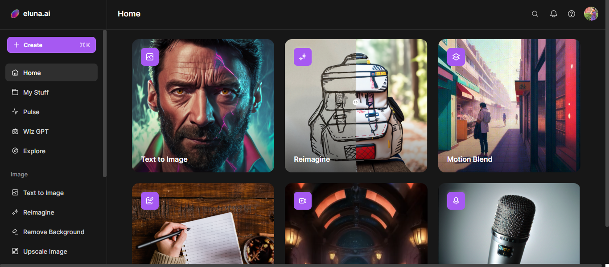

# Project Cinematic 01_16_2024 Demo

## Demo Scope

* Investigate Eluna AI text to Image generating app.

## Demo Loom

* Loom video link - https://youtu.be/4JEVJStygWA?si=2g_9C906XcsA_36D

* Eluna AI app is used to create images from a text prompt.

* It is used to create images with previously tested text prompts.

* Eluna AI - https://www.eluna.ai/

* This app has several AI tools in text to image generation.

* Let's view the text prompt and its corresponding image below.

### 1. A Teddy bear running in London city.

### 2. A Lion roaring on a rock.

### 3. Robot dancing in New York city.

### 4. Shark swimming through the coral reef.

### 5. A Boy walking on the beach.

